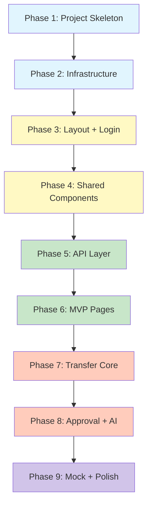

# SITS-Web 前端项目实施计划

## 项目信息

- **项目位置**: `D:\Frontend\inventory-transfer-web`
- **后端项目**: `D:\Develop\inventory-transfer` (Spring Boot 3.x, port 8080)
- **技术栈**: Vue 3 + TypeScript + Vite + Element Plus + Pinia + Vue Router + Axios + ECharts

---

## 后端 API 实际接口映射（从源码分析）

### 认证模块 (`/api/auth`)
| 方法 | 路径 | 参数 | 返回 |
|------|------|------|------|
| POST | `/api/auth/login` | `userId` (query), `password` (query) | `{tokenName, tokenValue, userId}` |
| POST | `/api/auth/logout` | - | - |
| GET | `/api/auth/check` | - | `{isLogin, loginId, roles}` |

### 仓库管理 (`/api/warehouses`)
| 方法 | 路径 | 参数 | 返回 |
|------|------|------|------|
| GET | `/api/warehouses` | PageQuery (pageNum, pageSize) | PageResult\<Warehouse\> |
| GET | `/api/warehouses/{id}` | id: number | Warehouse |
| POST | `/api/warehouses` | WarehouseCreateDTO body | Warehouse |
| PUT | `/api/warehouses/{id}` | WarehouseUpdateDTO body | Warehouse |
| PUT | `/api/warehouses/{id}/disable` | id: number | - |

### SKU 管理 (`/api/skus`)
| 方法 | 路径 | 参数 | 返回 |
|------|------|------|------|
| GET | `/api/skus` | PageQuery (pageNum, pageSize) | PageResult\<Sku\> |
| GET | `/api/skus/{id}` | id: number | Sku |
| POST | `/api/skus` | SkuCreateDTO body | Sku |
| PUT | `/api/skus/{id}` | SkuUpdateDTO body | Sku |
| PUT | `/api/skus/{id}/disable` | id: number | - |

### 库存管理 (`/api/inventories`)
| 方法 | 路径 | 参数 | 返回 |
|------|------|------|------|
| GET | `/api/inventories` | warehouseId (query) | List\<WarehouseInventory\> |
| GET | `/api/inventories/{skuId}/{warehouseId}` | path vars | WarehouseInventory |
| GET | `/api/inventories/flows` | bizNo (query) | List\<InventoryFlow\> |

### 风险管理 (`/api/risks`)
| 方法 | 路径 | 参数 | 返回 |
|------|------|------|------|
| POST | `/api/risks/scan` | - | List\<InventoryRisk\> |
| GET | `/api/risks` | skuId, warehouseId, riskType, status (optional) | List\<InventoryRisk\> |
| PUT | `/api/risks/{riskId}/status` | status (query) | - |

### 调拨建议 (`/api/risks/suggestions`)
| 方法 | 路径 | 参数 | 返回 |
|------|------|------|------|
| POST | `/api/risks/suggestions/generate` | - | List\<TransferSuggestion\> |
| GET | `/api/risks/suggestions` | skuId, status (optional) | List\<TransferSuggestion\> |
| PUT | `/api/risks/suggestions/{suggestionId}/confirm` | - | - |
| PUT | `/api/risks/suggestions/{suggestionId}/reject` | - | - |
| PUT | `/api/risks/suggestions/{suggestionId}/convert` | - | - |

### 调拨单 (`/api/transfer-orders`)
| 方法 | 路径 | 参数 | 返回 |
|------|------|------|------|
| POST | `/api/transfer-orders` | skuId, sourceWarehouseId, targetWarehouseId, quantity, applicantId (query) | TransferOrder |
| GET | `/api/transfer-orders` | PageQuery | PageResult\<TransferOrder\> |
| GET | `/api/transfer-orders/{transferNo}` | transferNo: string | TransferOrder |
| GET | `/api/transfer-orders/{transferNo}/logs` | transferNo: string | List\<TransferOrderLog\> |
| POST | `/api/transfer-orders/{transferNo}/lock-stock` | operator (query) | - |
| POST | `/api/transfer-orders/{transferNo}/submit-approval` | operator (query) | - |
| POST | `/api/transfer-orders/{transferNo}/approve` | approver, comment (query) | - |
| POST | `/api/transfer-orders/{transferNo}/reject` | approver, comment (query) | - |
| POST | `/api/transfer-orders/{transferNo}/outbound` | operator (query) | - |
| POST | `/api/transfer-orders/{transferNo}/ship` | operator (query) | - |
| POST | `/api/transfer-orders/{transferNo}/inbound` | operator (query) | - |
| POST | `/api/transfer-orders/{transferNo}/cancel` | operator (query) | - |

### 审批 (`/api/approvals`)
| 方法 | 路径 | 参数 | 返回 |
|------|------|------|------|
| GET | `/api/approvals/by-biz/{bizNo}` | bizNo: string | List\<ApprovalRecord\> |
| POST | `/api/approvals` | bizType, bizNo, approverId, result, comment (query) | ApprovalRecord |

### AI Copilot (`/api/ai`)
| 方法 | 路径 | 参数 | 返回 |
|------|------|------|------|
| POST | `/api/ai/chat` | `{question: "..."}` body | `{question, answer}` |
| GET | `/api/ai/health` | - | `{status, module}` |

### 补偿任务 (`/api/risks/compensation-tasks`)
| 方法 | 路径 | 参数 | 返回 |
|------|------|------|------|
| GET | `/api/risks/compensation-tasks` | limit (default 50) | List\<CompensationTask\> |
| PUT | `/api/risks/compensation-tasks/{taskId}` | status, errorMessage (query) | - |

### 响应格式
```typescript
// 统一响应
interface Result<T> {
  code: number       // 200 = success
  message: string
  data: T
}

// 分页响应
interface PageResult<T> {
  total: number
  pages: number
  records: T[]
}

// 分页请求 (query params)
interface PageQuery {
  pageNum: number    // default 1
  pageSize: number   // default 20, max 100
}
```

---

## 目录结构

```
D:\Frontend\inventory-transfer-web/
├── public/
│   └── favicon.ico
├── src/
│   ├── api/                          # API 接口层
│   │   ├── index.ts                  # Axios 实例 + 拦截器
│   │   ├── auth.ts                   # 登录/登出/check
│   │   ├── warehouse.ts             # 仓库 CRUD
│   │   ├── sku.ts                   # SKU CRUD
│   │   ├── inventory.ts             # 库存查询/流水
│   │   ├── risk.ts                  # 风险扫描/查询/状态
│   │   ├── transferSuggestion.ts    # 调拨建议
│   │   ├── transferOrder.ts         # 调拨单 + 状态流转
│   │   ├── approval.ts              # 审批记录
│   │   ├── ai.ts                    # AI Copilot
│   │   └── compensation.ts          # 补偿任务
│   ├── assets/                       # 静态资源
│   ├── components/                   # 通用组件
│   │   ├── PageContainer/
│   │   │   └── index.vue            # 统一页面容器
│   │   ├── StatusTag/
│   │   │   └── index.vue            # 状态标签 (调拨单/建议/风险)
│   │   ├── RiskLevelTag/
│   │   │   └── index.vue            # 风险等级标签 (HIGH/MEDIUM/LOW)
│   │   ├── WarehouseSelector/
│   │   │   └── index.vue            # 仓库选择器 (远程搜索)
│   │   ├── SkuSelector/
│   │   │   └── index.vue            # SKU 选择器 (远程搜索)
│   │   ├── FlowTimeline/
│   │   │   └── index.vue            # 状态流转时间线
│   │   └── AiChatPanel/
│   │       └── index.vue            # AI 聊天面板
│   ├── layout/
│   │   ├── index.vue                # 主布局 (sidebar + header + main)
│   │   ├── Sidebar.vue              # 左侧菜单
│   │   ├── Header.vue               # 顶部栏 (用户信息/退出)
│   │   └── TabsView.vue             # 标签页
│   ├── router/
│   │   └── index.ts                 # 路由配置 + 守卫
│   ├── stores/
│   │   ├── user.ts                  # 用户状态 (token, userInfo, roles)
│   │   ├── permission.ts            # 权限状态 (routes, menus)
│   │   └── app.ts                   # 应用状态 (sidebar, theme, tabs)
│   ├── styles/
│   │   ├── index.scss               # 全局样式
│   │   ├── variables.scss           # SCSS 变量
│   │   └── transition.scss          # 过渡动画
│   ├── types/
│   │   ├── api.d.ts                 # API 响应类型
│   │   ├── warehouse.d.ts           # 仓库类型
│   │   ├── sku.d.ts                 # SKU 类型
│   │   ├── inventory.d.ts           # 库存类型
│   │   ├── risk.d.ts                # 风险类型
│   │   ├── transfer.d.ts            # 调拨类型
│   │   └── index.d.ts              # 通用类型
│   ├── utils/
│   │   ├── request.ts               # Axios 封装
│   │   └── constants.ts             # 常量/枚举映射
│   ├── views/
│   │   ├── login/
│   │   │   └── index.vue            # 登录页
│   │   ├── dashboard/
│   │   │   └── index.vue            # 首页看板
│   │   ├── warehouse/
│   │   │   └── index.vue            # 仓库管理
│   │   ├── sku/
│   │   │   └── index.vue            # SKU 管理
│   │   ├── inventory/
│   │   │   ├── index.vue            # 库存看板
│   │   │   ├── detail.vue           # 库存详情
│   │   │   └── flow.vue             # 库存流水
│   │   ├── risk/
│   │   │   ├── index.vue            # 风险列表
│   │   │   └── detail.vue           # 风险详情
│   │   ├── suggestion/
│   │   │   ├── index.vue            # 调拨建议列表
│   │   │   └── detail.vue           # 调拨建议详情
│   │   ├── transfer/
│   │   │   ├── index.vue            # 调拨单列表
│   │   │   └── detail.vue           # 调拨单详情
│   │   ├── approval/
│   │   │   └── index.vue            # 审批中心 (tabs: 待审批/已审批/记录)
│   │   ├── rule/
│   │   │   └── index.vue            # 规则配置
│   │   ├── ai/
│   │   │   └── index.vue            # AI Copilot 聊天
│   │   └── system/
│   │       ├── user.vue             # 用户管理
│   │       ├── role.vue             # 角色管理
│   │       └── log.vue              # 操作日志
│   ├── App.vue
│   ├── main.ts
│   └── env.d.ts                     # Vite 环境类型声明
├── .env.development
├── .env.production
├── index.html
├── package.json
├── tsconfig.json
├── tsconfig.node.json
└── vite.config.ts
```

---

## 路由设计

```typescript
const routes = [
  { path: '/login', name: 'Login', component: () => import('@/views/login/index.vue') },
  {
    path: '/',
    component: () => import('@/layout/index.vue'),
    redirect: '/dashboard',
    children: [
      { path: 'dashboard', name: 'Dashboard', meta: { title: '首页看板', icon: 'DataBoard' } },
      // 基础资料
      { path: 'base/warehouse', name: 'Warehouse', meta: { title: '仓库管理', icon: 'Box' } },
      { path: 'base/sku', name: 'Sku', meta: { title: 'SKU管理', icon: 'Goods' } },
      // 库存中心
      { path: 'inventory/list', name: 'InventoryList', meta: { title: '库存看板', icon: 'List' } },
      { path: 'inventory/detail/:skuId/:warehouseId', name: 'InventoryDetail', meta: { title: '库存详情', hidden: true } },
      { path: 'inventory/flow', name: 'InventoryFlow', meta: { title: '库存流水', icon: 'Document' } },
      // 风险中心
      { path: 'risk/list', name: 'RiskList', meta: { title: '库存风险', icon: 'Warning' } },
      { path: 'risk/detail/:id', name: 'RiskDetail', meta: { title: '风险详情', hidden: true } },
      // 调拨中心
      { path: 'suggestion/list', name: 'SuggestionList', meta: { title: '调拨建议', icon: 'ChatLineSquare' } },
      { path: 'suggestion/detail/:id', name: 'SuggestionDetail', meta: { title: '建议详情', hidden: true } },
      { path: 'transfer/list', name: 'TransferList', meta: { title: '调拨单', icon: 'Connection' } },
      { path: 'transfer/detail/:transferNo', name: 'TransferDetail', meta: { title: '调拨单详情', hidden: true } },
      // 审批中心
      { path: 'approval', name: 'Approval', meta: { title: '审批中心', icon: 'Checked' } },
      // 规则中心
      { path: 'rule', name: 'Rule', meta: { title: '规则配置', icon: 'Setting' } },
      // AI Copilot
      { path: 'ai/chat', name: 'AiChat', meta: { title: 'AI Copilot', icon: 'MagicStick' } },
      // 系统管理
      { path: 'system/user', name: 'SystemUser', meta: { title: '用户管理', icon: 'User' } },
      { path: 'system/role', name: 'SystemRole', meta: { title: '角色管理', icon: 'Avatar' } },
      { path: 'system/log', name: 'SystemLog', meta: { title: '操作日志', icon: 'Notebook' } },
    ]
  }
]
```

---

## 状态管理设计

### userStore (Pinia)
```typescript
interface UserState {
  token: string
  tokenName: string
  userId: string | null
  username: string
  nickname: string
  roles: string[]
  permissions: string[]
}
// Actions: login(userId, password), logout(), checkAuth(), getProfile()
```

### permissionStore (Pinia)
```typescript
interface PermissionState {
  routes: RouteRecordRaw[]
  menus: MenuItem[]
}
// Actions: generateRoutes(menus), hasPermission(perm)
```

### appStore (Pinia)
```typescript
interface AppState {
  sidebarOpened: boolean
  activeTab: string
  tabs: TabItem[]
}
// Actions: toggleSidebar(), addTab(), removeTab()
```

---

## Axios 封装设计

```typescript
// utils/request.ts
// 1. baseURL: from .env (dev: http://localhost:8080)
// 2. Request interceptor:
//    - Attach Sa-Token header: { satoken: tokenValue }
//    - Generate requestId via uuid
// 3. Response interceptor:
//    - Unwrap: if code === 200, return data
//    - 401: redirect to /login, clear token
//    - 403: message '无权限'
//    - Other: show error message
```

---

## 枚举/常量映射

从后端 Java 枚举派生前端常量：

```typescript
// 调拨单状态
export const TransferOrderStatusMap = {
  CREATED: '已创建',
  STOCK_LOCKED: '库存已锁定',
  APPROVING: '审批中',
  APPROVED: '审批通过',
  REJECTED: '审批拒绝',
  OUTBOUNDING: '出库中',
  OUTBOUNDED: '已出库',
  IN_TRANSIT: '运输中',
  INBOUNDING: '入库中',
  COMPLETED: '已完成',
  CANCELLED: '已取消',
  FAILED: '调拨失败',
} as const

// 风险等级
export const RiskLevelMap = { HIGH: '高风险', MEDIUM: '中风险', LOW: '低风险' } as const
// 风险类型
export const RiskTypeMap = { SHORTAGE: '缺货', OVERSTOCK: '积压' } as const
// 风险状态
export const RiskStatusMap = { NEW: '新建', PROCESSING: '处理中', RESOLVED: '已解决', IGNORED: '已忽略' } as const
// 调拨建议状态
export const SuggestionStatusMap = { GENERATED: '已生成', CONFIRMED: '已确认', REJECTED: '已拒绝', EXPIRED: '已过期', CONVERTED: '已转调拨单' } as const
// 仓库/SKU状态
export const CommonStatusMap = { 1: '正常', 0: '禁用' } as const
```

---

## 与后端的关键差异对齐

| 差异点 | 前端文档设计 | 后端实际实现 | 对齐方案 |
|--------|-------------|-------------|---------|
| 登录接口 | `POST /api/auth/login` JSON body | `POST /api/auth/login` query params (userId, password) | 使用 query params，返回 `{tokenName, tokenValue, userId}` |
| Token 格式 | `{token, expireTime}` | Sa-Token: `{tokenName: "satoken", tokenValue: "uuid..."}` | Axios 拦截器附加 header `satoken: tokenValue` |
| 调拨单标识 | `{id}` 数字 | `{transferNo}` 字符串 (如 TRF20240101...) | 所有调拨单操作使用 transferNo |
| 风险/建议 API | 分散路径 | 统一在 `/api/risks/` 下，建议在 `/api/risks/suggestions/` | 按后端路径封装 |
| 库存查询 | 分页列表 | `GET /api/inventories?warehouseId=` 返回全量列表 | 前端做客户端分页或请求后端加 PageQuery |
| 用户信息 | `GET /api/auth/profile` | `GET /api/auth/check` | 使用 check 接口，用户信息简化 |
| 菜单接口 | `GET /api/auth/menus` | 无此接口 | 前端本地定义菜单，通过 roles 过滤 |

---

## 实施阶段（执行顺序）

### 阶段 1：项目骨架 + 基础设施（8 个文件组）

```
[ ] 1.1 package.json (Vue 3, Vite, Element Plus, Pinia, Vue Router, Axios, ECharts, Day.js, NProgress, Sass)
[ ] 1.2 vite.config.ts (alias @, proxy /api -> localhost:8080, auto-import Element Plus)
[ ] 1.3 tsconfig.json + tsconfig.node.json
[ ] 1.4 .env.development / .env.production
[ ] 1.5 index.html
[ ] 1.6 src/main.ts (createApp, use router, pinia, ElementPlus)
[ ] 1.7 src/App.vue (router-view)
[ ] 1.8 src/env.d.ts
```

### 阶段 2：核心基础设施（5 个文件组）

```
[ ] 2.1 src/types/api.d.ts + index.d.ts (Result, PageResult, PageQuery 类型)
[ ] 2.2 src/utils/constants.ts (枚举映射)
[ ] 2.3 src/utils/request.ts (Axios 实例 + 拦截器)
[ ] 2.4 src/stores/user.ts (login/logout/checkAuth)
[ ] 2.5 src/stores/app.ts (sidebar/tabs)
```

### 阶段 3：Layout + 登录（5 个文件组）

```
[ ] 3.1 src/layout/index.vue (el-container 结构)
[ ] 3.2 src/layout/Sidebar.vue (el-menu, 递归菜单)
[ ] 3.3 src/layout/Header.vue (用户信息, 退出)
[ ] 3.4 src/views/login/index.vue
[ ] 3.5 src/router/index.ts (路由配置 + beforeEach 守卫)
```

### 阶段 4：通用组件（6 个组件）

```
[ ] 4.1 PageContainer (页面容器：标题 + 操作区 + 内容区)
[ ] 4.2 StatusTag (状态标签，根据 type 映射颜色)
[ ] 4.3 RiskLevelTag (风险等级标签：红/橙/黄/绿)
[ ] 4.4 WarehouseSelector (el-select + 远程搜索)
[ ] 4.5 SkuSelector (el-select + 远程搜索)
[ ] 4.6 FlowTimeline (el-timeline，根据状态日志渲染)
```

### 阶段 5：API 层（10 个文件）

```
[ ] 5.1 src/api/index.ts (导出 request 实例)
[ ] 5.2 src/api/auth.ts
[ ] 5.3 src/api/warehouse.ts
[ ] 5.4 src/api/sku.ts
[ ] 5.5 src/api/inventory.ts
[ ] 5.6 src/api/risk.ts
[ ] 5.7 src/api/transferSuggestion.ts
[ ] 5.8 src/api/transferOrder.ts
[ ] 5.9 src/api/approval.ts
[ ] 5.10 src/api/ai.ts
```

### 阶段 6：业务页面 - Phase 1 (MVP 核心)（5 个页面）

```
[ ] 6.1 Dashboard 首页看板 (统计卡片 + ECharts 图表预留)
[ ] 6.2 Warehouse 仓库管理 (列表 + 新增/编辑弹窗 + 启用/禁用)
[ ] 6.3 SKU 管理 (列表 + 新增/编辑弹窗 + 启用/禁用)
[ ] 6.4 Inventory 库存看板 (仓库维度查询 + 风险等级标签)
[ ] 6.5 Inventory Flow 库存流水 (按 bizNo 查询)
```

### 阶段 7：业务页面 - Phase 2 (调拨核心)（6 个页面）

```
[ ] 7.1 Risk 风险列表 (查询 + 扫描 + 忽略/解决)
[ ] 7.2 Risk Detail 风险详情 (信息展示 + AI 分析面板)
[ ] 7.3 Suggestion 调拨建议列表 (查询 + 确认/拒绝/转调拨单)
[ ] 7.4 Suggestion Detail 建议详情 (评分明细 + AI 解释)
[ ] 7.5 Transfer Order 调拨单列表 (状态筛选 + 状态相关操作按钮)
[ ] 7.6 Transfer Order Detail 调拨单详情 (FlowTimeline + 日志 + 库存流水 + 操作按钮)
```

### 阶段 8：业务页面 - Phase 3 (审批 + 高级)（4 个页面）

```
[ ] 8.1 Approval 审批中心 (待审批/已审批/记录 tabs)
[ ] 8.2 Rule 规则配置 (规则类型 tabs + CRUD)
[ ] 8.3 AI Copilot 聊天页 (聊天界面 + AiChatPanel)
[ ] 8.4 System 系统管理 (用户/角色/日志，简化版占位)
```

### 阶段 9：Mock 数据 + 联调准备

```
[ ] 9.1 创建 Mock 数据层 (src/api/mock/)，与真实 API 同签名
[ ] 9.2 按 .env 变量切换 mock/real
[ ] 9.3 全局 SCSS 样式完善
[ ] 9.4 NProgress 路由加载进度条
```

---

## 状态流转交互设计

### 调拨单各状态下的操作按钮映射

```
CREATED       → [提交审批, 取消]
STOCK_LOCKED  → [提交审批, 取消]
APPROVING     → [查看审批]
APPROVED      → [确认出库]
REJECTED      → [查看详情]
OUTBOUNDING   → [确认出库结果]
OUTBOUNDED    → [开始运输]
IN_TRANSIT    → [确认入库]
INBOUNDING    → [确认入库结果]
COMPLETED     → [查看详情]
CANCELLED     → [查看详情]
FAILED        → [查看异常, 重试]
```

### 二次确认弹窗（危险操作）

```
- 取消调拨单 → "确定取消调拨单 {transferNo}？将释放已锁定库存。"
- 审批拒绝   → "确定拒绝该调拨单？请填写拒绝原因。"
- 确认出库   → "确认调出仓已完成出库？库存将被扣减。"
- 确认入库   → "确认调入仓已完成入库？库存将被增加。"
```

---

## 图表设计（Dashboard）

使用 ECharts，图表类型：

| 图表 | 类型 | 数据来源 |
|------|------|---------|
| 风险趋势图 (近7天) | 折线图 | 暂无后端接口，Mock |
| 仓库风险分布 | 饼图 | 聚合 risk list |
| 调拨单状态分布 | 柱状图 | 聚合 transfer list by status |
| 调拨成本趋势 | 折线图 | 暂无后端接口，Mock |
| SKU 销量 TOP10 | 横向柱状图 | 暂无后端接口，Mock |

---

## 实施概览 Mermaid 图


